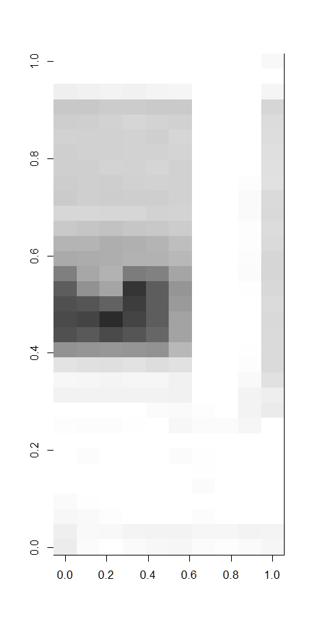
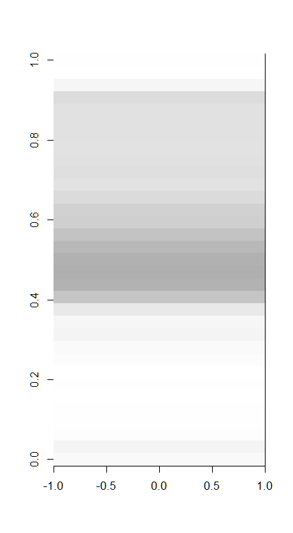
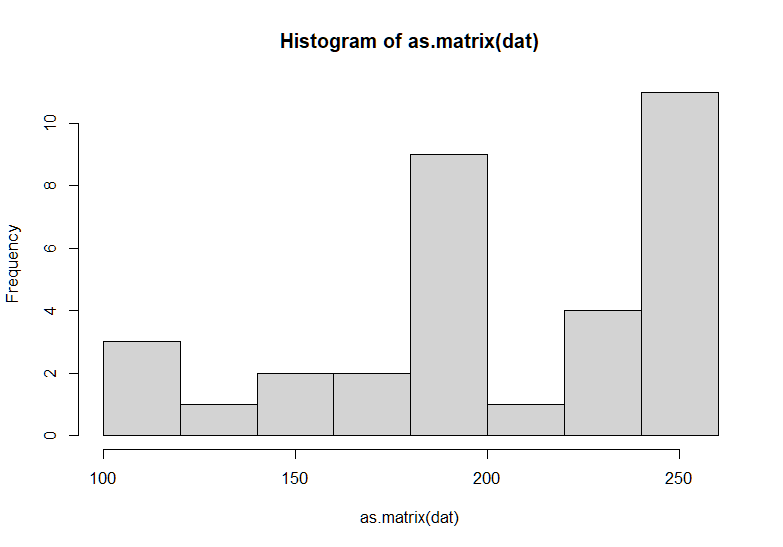

```{r include=FALSE}

if(!require(tidyverse)) install.packages("tidyverse", repos = "http://cran.us.r-project.org")
library("tidyverse")

load("./Rdata.RData")


```


\tableofcontents

\newpage

# Introduction

Machine learning is specially useful when we have to analyze thousands of data. It can also be useful to identify properties from a graphical source (computer vision). In this final project I practice how to use machine learning on a graphical set of images where we need to identify some characteristics on it.

This project is personally challenging as I assume it as an step forward from what we were taught in the course series. The most similar exercise we practiced in the course was the one to distinguish 2 or 7 from a hand-written set of numbers. In that exercise, we used black&white pixel information as features to train some basic machine learning algorithm. This projects starts form this concept, but it faces many new challenges such as image processing, the distortion produced by color, clustering algorithms, and untagged learning. To solve them, I self-learned some new libraries not provided in the course.

## Data source

The data set used in this project comes from a personal source. In order to make it available for the project review, it is uploaded on Github. It consists of a sequence of images of the West façade of a building. This façade comprises a regular matrix of windows, each one with an outdoor solar protection system. The photos were taken every hourly for a period of two weeks, always from the same angle and position of the camera.

```{r eval=TRUE, message=FALSE, warning=FALSE, echo=FALSE}

f_original <- list.files( folder_data_original_images , full.names = TRUE)
f_count <- length(f_original)

window_quantity_total <- window_quantity_x*window_quantity_y - length(windows_to_delete)

```

In total there are `r f_count` images, each one containing `r window_quantity_total` windows. In total, there are `r format( f_count*window_quantity_total , scientific=FALSE)` windows.

{width=50%}

## Aim

The aim of this project is to identify the position of the solar protections of every window of the façade using a machine learning algorithm.

\newpage

# Methods and analysis

Steps 1 and 2 correspond to the preparation of the images. Step 3 is the definition of the features required for machine learning algorithm. Steps 4 and 5 are two different methods for clustering based on the features. Step 6 corresponds to the tagging process.

## Image processing

The images from the dataset were taken 24/7. This means that the lighting conditions change regularly (from night to day, from backlight to indirect lighting), as shown in the following images:

{width=25%} {width=25%} {width=25%} {width=25%}

This first step of the method tries to enhance contrast and the tone of different materials to simplify the detection of differences with the machine learning algorith. This process is executed for all the images by applying a normalization method and a modulation method form the *magick* package. The previous images edited are the following:

{width=25%} {width=25%} {width=25%} {width=25%}

## Crop the position of every window

We want to obtain the position of the solar protection for every window. This means that, first, we need to crop every window from every image and save it as a new image. This process was automated by defining the position of the top-left window (variable `img_window1_crop`), the position of the bottom-right window (variable `img_windowN_crop`), the amount of windows in the X and Y direction (variables `window_quantity_x` and `window_quantity_y`) and the size of the windows in the image (variables `window_width` and `window_height`).

This project accounts for a defaults section in the *Rscript* file that simplifies the execution. However, this parameters were initially adjusted manually to fit the input images.

```{r eval=FALSE}

# DEFAULTS
if(!exists("facade")) { facade <- "West" }

if(!exists("img_max_width")) { img_max_width <- 1000 }

if(!exists("img_window1_crop")) { img_window1_crop <- "10x33+15+54" }
if(!exists("img_windowN_crop")) { img_windowN_crop <- "12x34+375+212" }

if(!exists("window_quantity_x")) { window_quantity_x <- 28 }
if(!exists("window_quantity_y")) { window_quantity_y <- 6 }

if(!exists("window_width")) { window_width <- 12 }
if(!exists("window_height")) { window_height <- 33 }

```

I generate a table of windows, indicating all the data related to the windows' position, name and crop parameters.

```{r eval=TRUE, message=FALSE, warning=FALSE, echo=FALSE}

knitr::kable( head(windows,6) ,
              caption = "First 6 rows of the `windows` table")

```

Then, the data in this table is used to massively crop all windows in all images and save them in a new folder.

## Defining the features of the windows

The features of each window are defined as the darkness of every pixel in the red channel. I pick up the red channel because, after the modulation of the images at the first step, light gets represented in cyan, and darkness in red or black.

Every window is a picture of `r window_width` by `r window_height` pixels. This means a total of `r window_height*window_width` pixels per window. The darkness of each pixel is read and stored in association with the ID of the window and the time stamp of the image. However, using every pixel as a feature could mean to overload the algorithm. I propose a simplification of the number of features: The desired value of the solar protections is the percentage of openness, equivalent to the percentage of daylight getting inside through the window. These solar protections open by sliding along some vertical rails. This mean the position of the solar protections is always horizontal. Thus, to simplify the amount of features, I sum up the values by row, moving from `r window_height*window_width` features to `r window_height` per window.

{height=30%}      {height=30%}      {height=30%}

\newpage

This is a sample of the first 15 features for the first 6 windows. Values range from 0 (black) to 255 (white).

```{r eval=TRUE, message=FALSE, warning=FALSE, echo=FALSE}

knitr::kable( head(select( windows_features , 1:16 ),6) ,
              caption = "Sample of the features for the first 6 windows. Values range from 0 (black) to 255 (white).")

```

And this is the distribution of darkness for the first image:

{width=70%}

\newpage

## Clustering: Method 1 -- The Kmeans algorithm

*[More information: https://en.wikipedia.org/wiki/K-means_clustering](https://en.wikipedia.org/wiki/K-means_clustering)*

Once defined the features at the previous step, the first clustering method used is the KMeans algorithm under the `stats` package. This algorithm clusters data according to a number of target clusters. For this reason, I initially have to decide the number of clusters. To do so, I use the `FitKMeans` function provided by the `useful` package. This function analyze sequentially the Hartigan's Number of a given number of clusters. If it is greater than 10, it considers that a new cluster should be added and recalculates the Hartigan's Number for the n+1 clusters. This process terminates when the `max.clusters` value is reached.

This is the code to calculate the number of required clusters. Seed number is a random number, but is fixed in order to ensure that always returns the same values.

```{r eval=FALSE}

# Get the data
features <- windows_features %>% select(-ID)

# Optimize the number of clusters based on the Hartigan’s rule
clusters_fit <- FitKMeans( features ,
                           max.clusters=100 ,
                           nstart=25 ,
                           seed=45357452 ,
                           iter.max = 10 )

clusters_quantity <- clusters_fit$Clusters[ which( clusters_fit$AddCluster == FALSE )[1] ]

```

I obtain that the required number of clusters is `r clusters_quantity`.

Then, I run clustering process with the desired number of clusters:

```{r eval=FALSE}

km <- kmeans( features , centers = clusters_quantity , nstart = 25 , iter.max = 100000 )

```

## Clustering: Method 2 -- A model based approach

The second method is based on the model based approach provided by the `mclust` package. The `Mclust` function selects the optimal model via an expectation-maximization algorithm initialized by hierarchical clustering for parameterized Gaussian mixture models.

The model is fitted with the following code. I use the same amount of clusters as in the previous method to be able to compare how well do they work:

```{r eval=FALSE}

# Model Based clustering
mb <- Mclust( features , G = clusters_quantity )

```

\newpage

# Results

## Results for method 1 -- The Kmeans algorithm

The Kmeans algorighem clustered the images in `r clusters_quantity` clusters. There are `r window_height` features per window, which means that the criteria of each cluster is difficult to plot. However, the image below corresponds to the clusters by the 2 most relevant characteristics.

```{r eval=TRUE, message=FALSE, warning=FALSE, echo=FALSE}

if(!require(cluster)) install.packages("cluster", repos = "http://cran.us.r-project.org")
library("cluster")

clusplot(windows_features, km$cluster, color=TRUE, shade=FALSE,
         labels=0, lines=0)

```

To evaluate whether the algorithm is clustering images according to the desired aim, the images below correspond to a random sample of 24 images from 4 of the clusters. We can see that all the images in each group have approximately the same position of the solar protections.

```{r eval=TRUE, message=FALSE, warning=FALSE, echo=FALSE}

if(!require(magick)) install.packages("magick", repos = "http://cran.us.r-project.org")
library("magick")

# Choose cluster to plot
i <- 2

filter <- windows_features %>% filter(clusterKM == i)

if( nrow(filter) < 24) { replacement <- TRUE } else { replacement <- FALSE }

set.seed(2000,sample.kind = "Rounding")

# Sample 24 images from the set
sample <- filter[ sample( nrow(filter) , 24 , replace = replacement ) , ]

# List all the files
img_temp <- paste( folder_data_windows_images ,
               paste( as.vector(sample["ID"])$ID , ".png", sep="" ),
               sep="/")

```

Sample of cluster number `r i` (contains `r nrow(filter)` elements in total):

```{r eval=TRUE, message=FALSE, warning=FALSE, echo=FALSE}
# Plot a grid of the sample images of the plot
image_read( img_temp ) %>% image_scale(200) %>% image_montage(tile = '6') %>% image_scale("200")

```

\newpage

```{r eval=TRUE, message=FALSE, warning=FALSE, echo=FALSE}

# Choose cluster to plot
i <- 14

filter <- windows_features %>% filter(clusterKM == i)

if( nrow(filter) < 24) { replacement <- TRUE } else { replacement <- FALSE }

set.seed(2000,sample.kind = "Rounding")

# Sample 24 images from the set
sample <- filter[ sample( nrow(filter) , 24 , replace = replacement ) , ]

# List all the files
img_temp <- paste( folder_data_windows_images ,
               paste( as.vector(sample["ID"])$ID , ".png", sep="" ),
               sep="/")
```

Sample of cluster number `r i` (contains `r nrow(filter)` elements in total):

```{r eval=TRUE, message=FALSE, warning=FALSE, echo=FALSE}
# Plot a grid of the sample images of the plot
image_read( img_temp ) %>% image_scale(200) %>% image_montage(tile = '6') %>% image_scale("200")

```


```{r eval=TRUE, message=FALSE, warning=FALSE, echo=FALSE}

# Choose cluster to plot
i <- 22

filter <- windows_features %>% filter(clusterKM == i)

if( nrow(filter) < 24) { replacement <- TRUE } else { replacement <- FALSE }

set.seed(2000,sample.kind = "Rounding")

# Sample 24 images from the set
sample <- filter[ sample( nrow(filter) , 24 , replace = replacement ) , ]

# List all the files
img_temp <- paste( folder_data_windows_images ,
               paste( as.vector(sample["ID"])$ID , ".png", sep="" ),
               sep="/")
```

Sample of cluster number `r i` (contains `r nrow(filter)` elements in total):

```{r eval=TRUE, message=FALSE, warning=FALSE, echo=FALSE}
# Plot a grid of the sample images of the plot
image_read( img_temp ) %>% image_scale(200) %>% image_montage(tile = '6') %>% image_scale("200")

```


```{r eval=TRUE, message=FALSE, warning=FALSE, echo=FALSE}

# Choose cluster to plot
i <- 63

filter <- windows_features %>% filter(clusterKM == i)

if( nrow(filter) < 24) { replacement <- TRUE } else { replacement <- FALSE }

set.seed(2000,sample.kind = "Rounding")

# Sample 24 images from the set
sample <- filter[ sample( nrow(filter) , 24 , replace = replacement ) , ]

# List all the files
img_temp <- paste( folder_data_windows_images ,
               paste( as.vector(sample["ID"])$ID , ".png", sep="" ),
               sep="/")
```

Sample of cluster number `r i` (contains `r nrow(filter)` elements in total):

```{r eval=TRUE, message=FALSE, warning=FALSE, echo=FALSE}
# Plot a grid of the sample images of the plot
image_read( img_temp ) %>% image_scale(200) %>% image_montage(tile = '6') %>% image_scale("200")

```

\newpage

## Results for method 2 -- A model based approach

The model based approach was clustered with the same amount of clusters as in the Kmeans algorithm, to make them comparable (`r clusters_quantity` clusters). To evaluate whether the algorithm is clustering images according to the desired aim, the images below correspond to a random sample of 24 images from 4 of the clusters. We can see that all the images in each group have approximately the same position of the solar protections.

```{r eval=TRUE, message=FALSE, warning=FALSE, echo=FALSE}

if(!require(magick)) install.packages("magick", repos = "http://cran.us.r-project.org")
library("magick")

# Choose cluster to plot
i <- 2

filter <- windows_features %>% filter(clusterMB == i)

if( nrow(filter) < 24) { replacement <- TRUE } else { replacement <- FALSE }

set.seed(2000,sample.kind = "Rounding")

# Sample 24 images from the set
sample <- filter[ sample( nrow(filter) , 24 , replace = replacement ) , ]

# List all the files
img_temp <- paste( folder_data_windows_images ,
               paste( as.vector(sample["ID"])$ID , ".png", sep="" ),
               sep="/")

```

Sample of cluster number `r i` (contains `r nrow(filter)` elements in total):

```{r eval=TRUE, message=FALSE, warning=FALSE, echo=FALSE}
# Plot a grid of the sample images of the plot
image_read( img_temp ) %>% image_scale(200) %>% image_montage(tile = '6') %>% image_scale("200")

```

```{r eval=TRUE, message=FALSE, warning=FALSE, echo=FALSE}

if(!require(magick)) install.packages("magick", repos = "http://cran.us.r-project.org")
library("magick")

# Choose cluster to plot
i <- 19

filter <- windows_features %>% filter(clusterMB == i)

if( nrow(filter) < 24) { replacement <- TRUE } else { replacement <- FALSE }

set.seed(2000,sample.kind = "Rounding")

# Sample 24 images from the set
sample <- filter[ sample( nrow(filter) , 24 , replace = replacement ) , ]

# List all the files
img_temp <- paste( folder_data_windows_images ,
               paste( as.vector(sample["ID"])$ID , ".png", sep="" ),
               sep="/")

```

Sample of cluster number `r i` (contains `r nrow(filter)` elements in total):

```{r eval=TRUE, message=FALSE, warning=FALSE, echo=FALSE}
# Plot a grid of the sample images of the plot
image_read( img_temp ) %>% image_scale(200) %>% image_montage(tile = '6') %>% image_scale("200")

```


```{r eval=TRUE, message=FALSE, warning=FALSE, echo=FALSE}

# Choose cluster to plot
i <- 22

filter <- windows_features %>% filter(clusterMB == i)

if( nrow(filter) < 24) { replacement <- TRUE } else { replacement <- FALSE }

set.seed(2000,sample.kind = "Rounding")

# Sample 24 images from the set
sample <- filter[ sample( nrow(filter) , 24 , replace = replacement ) , ]

# List all the files
img_temp <- paste( folder_data_windows_images ,
               paste( as.vector(sample["ID"])$ID , ".png", sep="" ),
               sep="/")
```

Sample of cluster number `r i` (contains `r nrow(filter)` elements in total):

```{r eval=TRUE, message=FALSE, warning=FALSE, echo=FALSE}
# Plot a grid of the sample images of the plot
image_read( img_temp ) %>% image_scale(200) %>% image_montage(tile = '6') %>% image_scale("200")

```

\newpage

# Comparison of the methods

In orther to compare both used methods in this project, the table below shows some numeric data of the distribution of the clusters for each method. The number of clusters was fixed to `r clusters_quantity`, so this value and the average of cluster size are equal in both methods. However, with the standard deviation (SD) we can see that the Kmeans method has more clusters close to the size of the mean than the Model Based Approach. The Kmeans method also generates generaly larger clusters: both the largest and the smallest cluster are larger than the ones for the Model Based Approach.

```{r eval=TRUE, message=FALSE, warning=FALSE, echo=FALSE}

# Create a summary table of both methods

table <- data.frame( "Value" = c( "Quant. of clusters" , "Average of cluster size" , "SD of cluster size" , "Size of largest" , "Size of smallest" ),
                     "KM method" = c( length(analysis$KMsize) , mean(analysis$KMsize) , sd(analysis$KMsize) , max(analysis$KMsize) , min(analysis$KMsize) ),
                     "MB method" = c( length(analysis$MBsize) , mean(analysis$MBsize) , sd(analysis$MBsize) , max(analysis$MBsize) , min(analysis$MBsize) )
                     )

knitr::kable( table )

```

The boxplot below shows the distribution of the clusters sizes per method:

```{r eval=TRUE, message=FALSE, warning=FALSE, echo=FALSE}

# Boxplot of distribution

analysis %>% pivot_longer(cols=c("KMsize","MBsize"),
                          names_to = "method",
                          values_to = "size") %>%
        ggplot( aes( y=size , x=method , fill = method) ) +
          geom_boxplot(alpha=0.5) +
          theme_minimal()


```

\newpage

To finish with, the following histogram also shows the distribution of the clusters sizes per method:

```{r eval=TRUE, message=FALSE, warning=FALSE, echo=FALSE}

# Boxplot of distribution

analysis %>% pivot_longer(cols=c("KMsize","MBsize"),
                          names_to = "method",
                          values_to = "size") %>%
        ggplot( aes(y=size, fill=method)) +
          geom_histogram( color="#e9ecef", alpha=0.5) +
          theme_minimal()

```

\newpage

# Discussion and future works

Although the results of the method show that it is possible to identify and classify the position of solar protections, some clusters as desired, but they are clustered by similarity in other ways, such as shadows or intensity of colors. The clustering process could be optimized with the following recommendations:

* The success of the image recognition process is strongly related with the quality of the source images. In this project, images were taken 24/7, which means that they have different levels, contrast and colors. At the beginning of this project, I accounted for this possibility and I included a first step in the method to achieve uniform levels for images. It is performed using automatic tools provided by the `magick` package in R. However, this normalization tools does not seem to be enough. For future works, it is recommended to invest on a good normalization of images before working with them.

* Also the crop of the windows could be improved. In this project, the crop is made by a regular grid assuming that the façade is perfectly flat. However, the curvature of the lens makes some distortion and some windows do not get cropped as expected. For future works, it is recommended to correct the lens distortion and ensure that the windows are perfectly fitted with the crop.

* The last but not the least, the simplification of pixel darkness by row was used in this project to simplify the processing of the algorithms. However, it was not verified whether it has any counter effect on the results. For future works, this assumption should be verified.

# Conclusion

This project is about the identification of the position of some manually controlled solar protections from images. To do so, I used two machine-learning algorithms to clustering the images by similarity, as this is an untagged learning process. Images are initially processed to enhance colors and contrast, then the darkness of the pixel rows are converted into numberic values to become the features for the final machine learning clustering process. The Kmeans algorithm and the Model Based Approach are used.

In conclusion, the Kmeans algorithm gets clusters of larger size, while the the Model Based Approach generate slightly better equally distributed clusters. However, the performance of a machine learning algorithm should not be evaluated from the size of the clusters, but from the quality classifying images according to the aim. From a qualitative analysis of the samples showed in the results section, the Kmeans algorithm groups together images that are similar in terms of position of the solar protection. The Model Based Approach, however, has some mixed results.

\newpage

# References and tools

Broman K (2022). _broman: Karl Broman's R Code_. R package version 0.80, <https://CRAN.R-project.org/package=broman>.

Hennig C (2023). _fpc: Flexible Procedures for Clustering_. R package version 2.2-10, <https://CRAN.R-project.org/package=fpc>.

Maechler, M., Rousseeuw, P., Struyf, A., Hubert, M., Hornik, K.(2022).  cluster: Cluster Analysis Basics and Extensions. R package version 2.1.4.

Ooms J (2021). _magick: Advanced Graphics and Image-Processing in R_. R package version 2.7.3, <https://CRAN.R-project.org/package=magick>.

Ochi S (2021). _magickGUI: GUI Tools for Interactive Image Processing with 'magick'_. R package version 1.3.0, <https://CRAN.R-project.org/package=magickGUI>.

Scrucca L., Fop M., Murphy T. B. and Raftery A. E. (2016) mclust 5: clustering, classification and density estimation using Gaussian finite mixture models The R Journal 8/1, pp. 289-317

R Core Team (2022). R: A language and environment for statistical computing. R Foundation for Statistical Computing, Vienna, Austria. URL https://www.R-project.org/.


